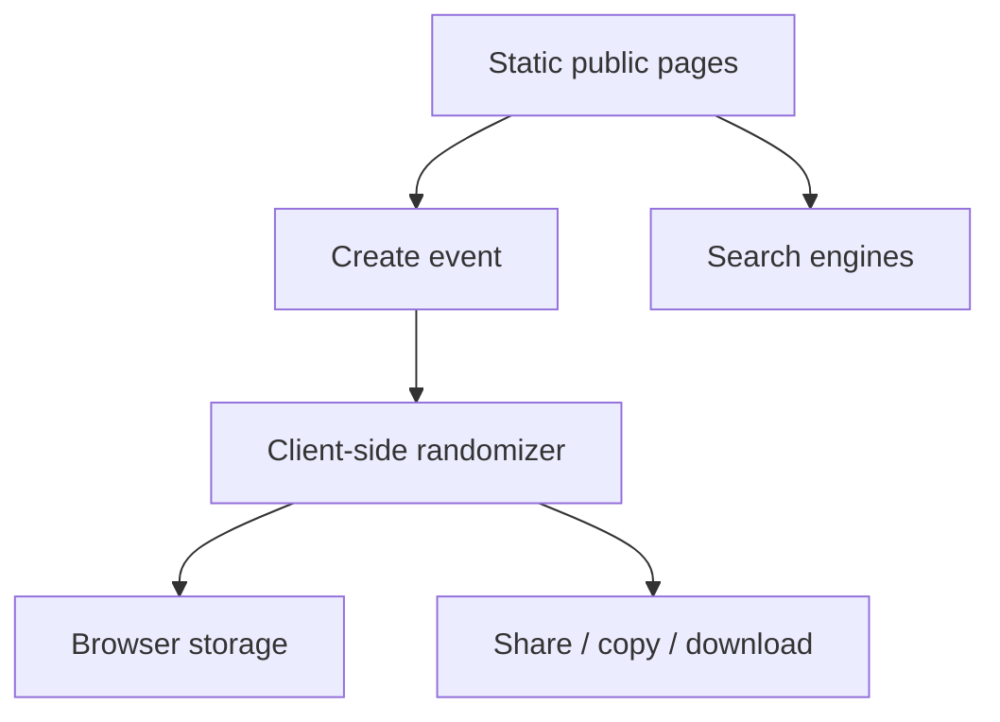

# Architecture

## Recommended architecture

Use a static-first Next.js application with client-side event state. This supports SEO pages and metadata while keeping the randomizer private, fast, and inexpensive.



No database or application API is required for MVP.

## Proposed routes

| Route | Purpose | Rendering |
| --- | --- | --- |
| `/` | Product landing page | Static/server-rendered HTML |
| `/create` | Event builder | Static shell + client component |
| `/randomize` | Active wheel and results | Client component; noindex recommended |
| `/fantasy-football-draft-randomizer` | Football use case and preset | Static HTML |
| `/golf-group-randomizer` | Golf use case and preset | Static HTML |
| `/team-randomizer` | Generic sports/team use case | Static HTML |
| `/how-it-works` | Fairness, privacy, and instructions | Static HTML |
| `/about` | Product story | Static HTML |
| `/privacy` | Privacy policy | Static HTML |
| `/terms` | Terms | Static HTML |
| `/contact` | Contact method | Static HTML |

## Proposed source layout

```text
src/
  app/
    page.tsx
    create/page.tsx
    randomize/page.tsx
    fantasy-football-draft-randomizer/page.tsx
    golf-group-randomizer/page.tsx
    team-randomizer/page.tsx
    layout.tsx
    manifest.ts
    robots.ts
    sitemap.ts
  components/
    event-builder/
    wheel/
    results/
    marketing/
  domain/
    randomizer.ts
    participants.ts
    event.ts
  hooks/
  lib/
  styles/
tests/
  unit/
  e2e/
public/
```

## Core data model

```ts
type Theme = "football" | "baseball" | "golf" | "basketball" | "generic";
type SpinMode = "manual" | "auto";
type RankDirection = "ascending" | "descending";

interface RandomizerEvent {
  id: string;
  name: string;
  theme: Theme;
  mode: SpinMode;
  rankDirection: RankDirection;
  participants: string[];
  remaining: string[];
  results: Array<{ rank: number; name: string }>;
  createdAt: string;
  version: 1;
}
```

Do not store participant email addresses in this object.

## Fair selection algorithm

Generate a random integer in `[0, remaining.length)` using `crypto.getRandomValues()` and rejection sampling. Modulo alone introduces a small mathematical bias unless the random range divides evenly. Tests should inject a deterministic random-number provider, making outcomes testable without weakening production randomness.

The wheel animation visualizes a selection already made by the domain function. Animation must never determine the winner.

## Local persistence

- Store one versioned active event in `localStorage`.
- Validate stored data before restoring it.
- Clear it when the user confirms **Start Over**.
- Never store email recipients.
- Provide a future migration path by incrementing `version`.

## Email decision

MVP uses `mailto:` because it requires no backend and keeps recipient handling on the device. It cannot confirm delivery and may be limited by URL length. Copy and `.csv` download are mandatory fallbacks.

A later transactional-email phase would add a server route, email provider, rate limiting, CAPTCHA/abuse controls, consent language, logs, and privacy updates.

## Testing layers

- Unit: parsing, normalization, validation, unbiased index helper, ranking, state transitions, serialization
- Component: builder errors, theme selection, auto countdown, pause/resume, result actions
- End-to-end: landing → create → spin → results; upload; refresh recovery; iPhone viewport; keyboard flow
- Manual: actual iPhone Safari installation, email-client handoff, offline reload, visual motion and spacing

